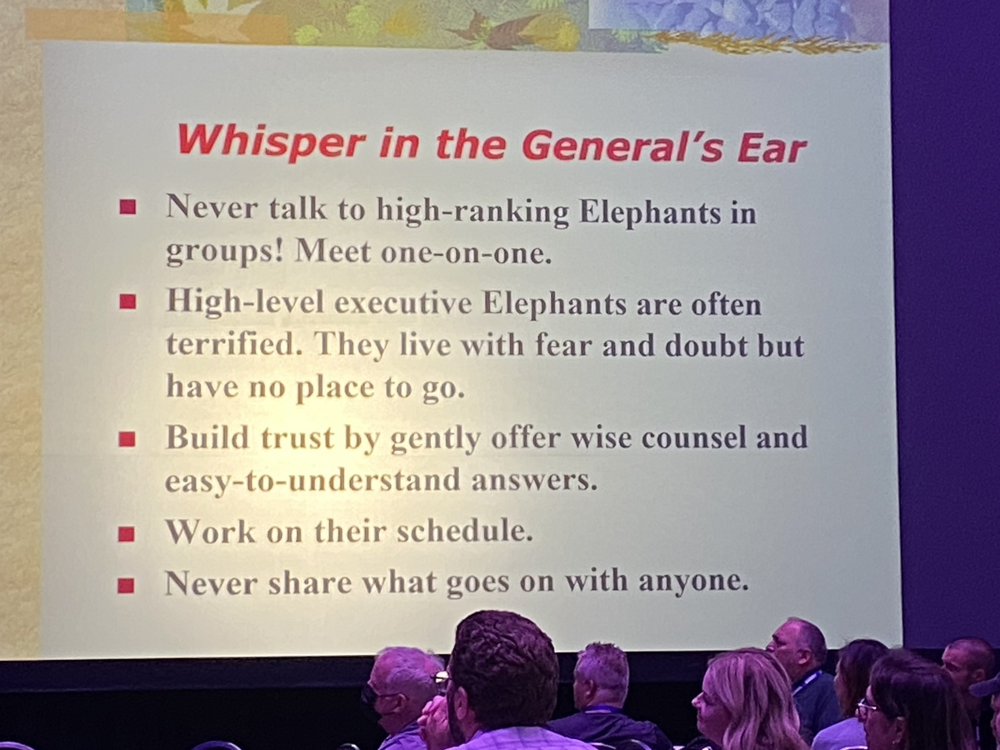
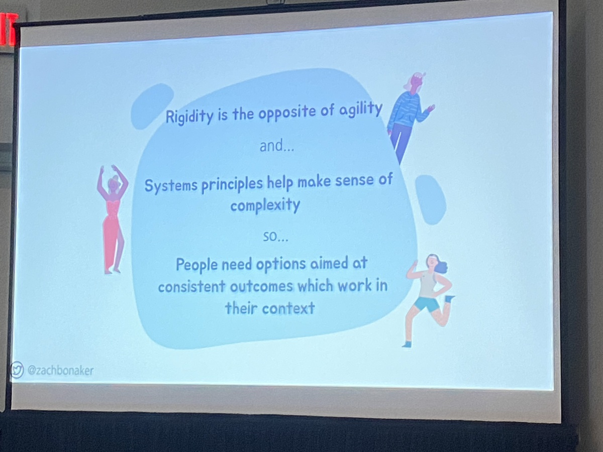

# Agile & Beyond 2022

*May 24-45th, 2022*  
Detroit

## Keynote: Deep Gamification: Designing Team Agency
with [Jessica Kerr](https://twitter.com/jessitron)

When something is given a score, it narrows our vision of what we're actually trying to accomplish.

<blockquote class="twitter-tweet">
“It’s funny how one tiny extrinsic motivation can just smash all of your intrinsic motivation.” <a href="https://twitter.com/jessitron?ref_src=twsrc%5Etfw">@jessitron</a> <a href="https://twitter.com/hashtag/aab22?src=hash&amp;ref_src=twsrc%5Etfw">#aab22</a> <a href="https://twitter.com/hashtag/gamification?src=hash&amp;ref_src=twsrc%5Etfw">#gamification</a>
&mdash; Fazzaro (@jonfazzaro) <a href="https://twitter.com/jonfazzaro/status/1529101097914322949?ref_src=twsrc%5Etfw">May 24, 2022</a></blockquote> 

"Striving Play", when we are aiming for the victory condition

"Our best score is not the same as our best work."

The usual tropes of gamification (badges!) are shallow. They are also not portable--a mechanic that makes one game can ruin another. "Copy the questions, not the answers"!

Games show that we can design agency.

<blockquote class="twitter-tweet">
yes. individual engineers can *write* software, but only teams can deliver, ship, maintain and own software.  the smallest unit of software delivery is the team. <a href="https://t.co/mkYPvzRuDh">https://t.co/mkYPvzRuDh</a>
&mdash; Charity Majors (@mipsytipsy) <a href="https://twitter.com/mipsytipsy/status/1514695291420643328?ref_src=twsrc%5Etfw">April 14, 2022</a></blockquote> 

**A blocking Pull Request workflow creates competition**. The goal of the reviewer is to *not* release software.

**Counterintuitively, mobbing is less draining than pairing**. It's okay if your mind wanders a bit in an ensemble.

**Symmathesy**  

+ a learning system made up of learning parts (people, code, tools, etc.)
+ not linear, not the sum of its parts
+ the product of all of its past interactions

"Are our rules helping up to add capabilities? Or are we just getting scared and adding more checkboxes?"

"Accidental gamification corrodes systems."

### Resources

[Try Hack Me](https://tryhackme.com)

## EEP! Extreme Embedded Programming
with Clayton Dowling and Charlie Snider

(Mostly on the benefits of using TDD to develop embedded systems)

Using unit tests on embedded code **isolates software vs. hardware problems** (a common cause of debugging confusion when working with embedded systems).

As we learn about the hardware's behavior, **what we learn gets encoded into the mocks used in the tests**. This creates a ratchet against regression.

For those working under regulation, **tests passively create an automated trail of documenation**.

Tests also provide **insulation against supply chain problems**, allowing developers to continue their work even when the hardware is not available for testing.

**V&V** ([Software verification and validation](https://en.wikipedia.org/wiki/Software_verification_and_validation)) regulated mandated separation of coding/testing operations.

## The Hunt for the Elusive Agile Architecture
with [Doc Norton](https://twitter.com/docondev)

"We don't know what software architecture is--we just say stuff and call it architecture."

**Entropy!** Regardless of the initial intended architecture, components slough across boundaries over time.

**Microservice architectures are also monolithic**--nothing deploys into a vacuum. The services grow more dependent on one another over time, despite attempts to keep them independent.

**Successful architecture** allows major decisions to be deferred. It is an aspect of the code itself, its boundaries.

<blockquote class="twitter-tweet">
“Your architecture is in your code [not in a model, diagram, or concept].” <a href="https://twitter.com/DocOnDev?ref_src=twsrc%5Etfw">@DocOnDev</a> <a href="https://twitter.com/hashtag/AgileAndBeyond?src=hash&amp;ref_src=twsrc%5Etfw">#AgileAndBeyond</a> <a href="https://twitter.com/hashtag/aab22?src=hash&amp;ref_src=twsrc%5Etfw">#aab22</a>
&mdash; Fazzaro (@jonfazzaro) <a href="https://twitter.com/jonfazzaro/status/1529499987490574336?ref_src=twsrc%5Etfw">May 25, 2022</a></blockquote> 

## Day 2 Keynote: How to Talk toq the Elephant
with [Linda Rising](https://twitter.com/RisingLinda)

[*Thinking Fast & Slow*](https://www.goodreads.com/book/show/11468377-thinking-fast-and-slow) by Daniel Kahneman is "the most agile book in recent time".

**System 1**: Fast, subconscious, right brain, the bulk of the iceberg, the elephant.
**System 2**: Slow, linear, left brain, the tip of the iceberg, the rider. *The more science learns about the brain, the more this part shrinks*.

**Use a Personal Touch**. Understand the other person's elephant and path, their environment and situation.

**Direct the Rider** to the bright spots! (*Naive Realism*: the mistaken belief we are rational and logical.)

### Motivate the Elephant

* Don't spook them.  
* *Tell them stories*!  
* Use food if you can (over lunch?).  
* Show them small successes! Use baby steps. They love to see their own progress.
* Make the path easier
* Nudge the elephant
* Rally the herd (focus on those who adopt the change early)

### Fear Less

* Listen
* Be a trampoline
* Hear the other person out, be curious and respectful
* Stay in contact

This doesn't just apply to people in positional authority (executives, managers), but also to those with power or influence relationally as well.

### Resources

[Braver Angels](https://braverangels.org)

## Simple Rules for Business Agility
with [Zach Bonaker](https://twitter.com/zachbonaker)

<blockquote class="twitter-tweet">
“<a href="https://twitter.com/hashtag/BusinessAgility?src=hash&amp;ref_src=twsrc%5Etfw">#BusinessAgility</a> <a href="https://twitter.com/hashtag/protip?src=hash&amp;ref_src=twsrc%5Etfw">#protip</a>: it’s made up.” <a href="https://twitter.com/zachbonaker?ref_src=twsrc%5Etfw">@zachbonaker</a> <a href="https://twitter.com/hashtag/aab22?src=hash&amp;ref_src=twsrc%5Etfw">#aab22</a> <a href="https://twitter.com/hashtag/AgileAndBeyond?src=hash&amp;ref_src=twsrc%5Etfw">#AgileAndBeyond</a>
&mdash; Fazzaro (@jonfazzaro) <a href="https://twitter.com/jonfazzaro/status/1529500367502954502?ref_src=twsrc%5Etfw">May 25, 2022</a></blockquote> 

### Systems of Work x Systems of People

> In order to remain unchanged, the system must change, specifically.

― John Gall, SYSTEMANTICS. THE SYSTEMS BIBLE

> When a system stops adapting, it is dead.

― [Design in Nature](https://www.goodreads.com/book/show/3070733-design-in-nature)

**Keep it loose**, give people (at least three) options.

### Use *Simple* Rules!

* they stick
* they respect context
* they enable collective action
* they are useful until they aren't

### 3 C's (via Esther Derby + Don Gray)

* Clarity
* Conditions
* Constraints

**WIIFM** (what's in it for me?)

### "Giving people options is more important than consistency."

### "Make work visible at all levels."

A powerful, simple rule.

## Archimedes Lever: Utilizing Hidden Costs as Change Lever and Improvement Metric

with Brian Irwin

[**SEAM**](http://www.seaminstitute.org) (Socio-Economic Approach to Management). The **socio** and **economic** factors are interlinked, interdependent, like sides of a coin. (Connection back to Bonaker's *Systems of Work/People* chart)

Don't get distracted by the cost of change. "Show them the cost of *not* changing."

[TFW (Taylorism-Foolism-Weberism) Virus](https://fr.wikipedia.org/wiki/Virus_TFW)

### Results Pyramid

Focus your efforts on that bottom layer.

### Make hidden costs visible!

+ Interview staff/team members. Ask them about what isn't working the way it should. How much time do they spend on those things?
+ Compute the normalized **$ per hour per person** for the company
    + (Total operating costs - variable operating costs for a year)/2080 working hours/# of heads
+ Multiply that by the hours spent on the wasteful activities mentioned above

In Brian's experience, he's **never seen this amount to less than $42k per person per year**.

## Lead Without Blame
with [Diana Larsen](https://twitter.com/DianaOfPortland) 

<blockquote class="twitter-tweet">
“We learn in the direction of the questions we ask ourselves.”<a href="https://twitter.com/DianaOfPortland?ref_src=twsrc%5Etfw">@DianaOfPortland</a> <a href="https://twitter.com/hashtag/agileandbeyond?src=hash&amp;ref_src=twsrc%5Etfw">#agileandbeyond</a> <a href="https://twitter.com/hashtag/aab22?src=hash&amp;ref_src=twsrc%5Etfw">#aab22</a>
&mdash; Fazzaro (@jonfazzaro) <a href="https://twitter.com/jonfazzaro/status/1529520868417847296?ref_src=twsrc%5Etfw">May 25, 2022</a></blockquote> 

**Hold people accountable** <------ OR ------> **Lead through learning**

"~~Knowledge~~ Learning Work"

### Motivators

* Autonomy
* Purpose
* ~~Mastery~~ Co-intelligence ("bench strength")

### Learning Leaders 4 C's

* Courage (e.g., showing vulnerability)
* Comparison
* Complexity
* Confidence

## Efficient?! Ensemble Programming!? How?
with [Tim Ottinger](https://twitter.com/tottinge)

> Watch the baton, not the runners.

&ndash; Don Reinertsen

There is an undue amount of attention given to speeding up development work. In a traditional team of solo devs, hands-on-keys work typically *only accounts for a small percentage the total lead time*. Most of the time, the work sits in a queue somewhere, **waiting**.

Even if they were to double the speed of their dev work, that would only produce a 2.5% gain in speed overall. Also: **no one can double their development speed**. That's not a thing.

### "Where there is a handoff, there is a queue."

**A hypothetical team** spends 60% of their development time fixing bugs. What if they could eliminate bug work by going 2x *slower*? This would result in a net lead time reduction (speed gain) of 20%: 

    (100% - 60%) * 2x = 80%
    
### Ensemble programming
    
"Every bit of work you have in progress is another reason for someone to interrupt you."

**Ensemble programming** (including pairing) is inherently more efficient because it replaces handoffs and the considerable lead time between touches with real-time interactions.

