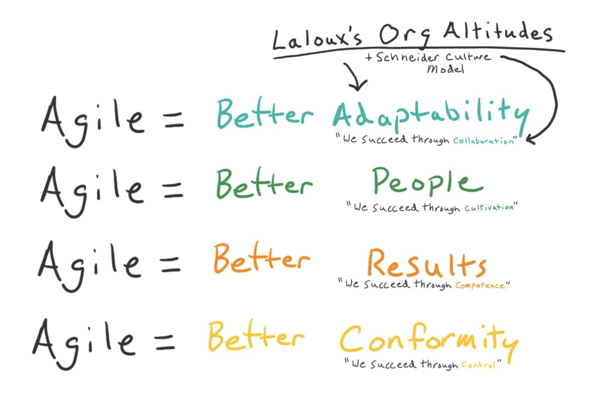

# AgileDC
*October 23, 2023*  
*Washington, DC*

## Becoming The Coach You Always Knew You Could Be
with [Ken Rickard](https://www.linkedin.com/in/kennethrickard/)

So your transformation is stuck. Why?  
*Could it be you, the coach?*

"Agile" has come to mean "more/better at [whatever the org is after]." What they're after depends on the level they're operating on:

The purpose of a coach is to help people change, regardless of what the change is.

But "Agile" only means change to an organization already operating at a higher level. At lower levels, it means "frameworks".

## The Road Not Taken: Revisiting An Alternative to Capital One's Agile Restructuring
with [Doug Steele](https://www.linkedin.com/in/dougsteeledc/)

In January 2023, Capital One discontinued the role of Agile Coach in their organization, and laid off about 1,100 people who were in that role.

The Agile Industrial Complex went nuts. Some were up in arms, others turned to self-flagellation. For Capital One, though, it was "the right business decision."

Their CIO declared "Mission Accomplished" on their agile transformation in 2019. At this point, at the division level and below, 70% of teams had adopted SAFe.

The work that the Agile Coaches were doing was taken on mostly by Technical Product/Program Managers.