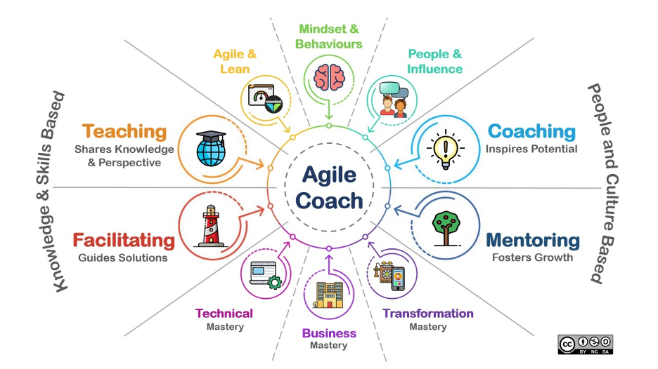

# Cincy Deliver 2023

*July 28th, 2023*  
Cincinnati, OH

### Agile Coaching

with [Art Lashchonau](https://www.linkedin.com/in/lashchonau/) and [Brad Nelson](https://www.linkedin.com/today/author/bradgile)

+ Requires the emotional intelligence to influence without authority
+ Professional coaching only accounts for about 5% of the work

### Impediments to agility at scale

+ inconsistency
+ hyperfocus
+ lack of purpose
+ lack of engagement

+ A coach *doesn't need to know everything* to be effective.

+ Agile Coaches spend a significant amount of energy justifying our existence and expense.

### A structured approach

+ organizational objectives (not "Agile")
+ set in a contract, with a timebox
+ make a plan to achieve them
+ establish communication channels
+ standardize the basics
    + definition of done
    + practices needed to solve problems

### How do we get managers to embrace coaches + coaching?

Use Scrum as a vehicle for agility *if that's what they're already using*

We tend to focus on team coaching first, but that may not be the right place to start. Managers tend to respond to PowerPoint (lol)

Scaling builds a coaching competency, not just a team-level coaching engagement for a team that may only end up disbanded.

## Quantifying Technical Debt

with [Nick Fahrig](https://www.linkedin.com/in/nick-fahrig)

Ask...

+ Don't care: "Is the team under too much pressure?"
+ Don't know: "Does the team have the right skills/people?"
+ Didn't mean to: "What did we learn? How can we apply it?"
+ Leverage: "How can we track the debt to ensure it gets paid?"

📄 [In Search of a Metric for Managing Architectural Technical Debt](https://ieeexplore.ieee.org/document/6337765) (R. Nord, et al)

As with real debt: 

1. Always pay down more than the minimum
1. Cut up your credit cards--stop accruing!
1. Make a realistic plan for paying it down.

## Choose Your Own Adventure: Lessons Learned from an Unusual Journey

with [Jay Tower](https://www.linkedin.com/in/jtower)

[48statesproject.com](https://48statesproject.com)

### How to foster adventure in your life

1. **Terrior** ("soil"). When you're in an unfamiliar place, don't stick to what you know (like chain restaurants). Seek out things and experiences that are *of* the place you're in.  
1. **The Rule of Anecdotal Value**. Useful for making life decisions. Which option will make the better story?
1. **Seek out discomfort**. Be an "outside" person. Do things that require hard work.
1. **Experiences over possessions**.
1. **Curiosity over judgement**. Judgement leads to fear, and fear shuts down adventure.
1. **Surround yourself with adventurers**. A story for this one: 

    > A young math major chooses to become a Wall Street [Quantitative Analyst](https://en.wikipedia.org/wiki/Quantitative_analysis_(finance)). Quants make lots of money, and they tend to live a very fast-paced, work hard/play hard/spend hard lifestyle. But he figured that he would only do it for 5 years, live simply and save enough to retire young. But he quickly adopted the same loud/fast lifestyle of the other quants he worked with day in, day out. It's been 20 years, and he's still nowhere near retirement.
    
## Mad Scientists, Saboteurs, and Con Artists: Seven Agile Habits of Highly Effective Supervillains

with [Ben Friedberg](https://www.linkedin.com/in/ben-friedberg-7ab1497)

📘 [Simple Sabotage Manual](https://en.wikisource.org/wiki/Simple_Sabotage_Field_Manual) (1944, [OSS](https://en.wikipedia.org/wiki/Office_of_Strategic_Services))

> We write for our future selves!

On a team, **be essential, but not critical**. Be the best at something, but don't be the only person who can do it at all.

> The most important part of failure is publication.
  
## The Velocity Trap

with [Brad Nelson](https://www.linkedin.com/today/author/bradgile)

[Lord Kelvin](https://skeptics.stackexchange.com/questions/42436/did-lord-kelvin-say-if-you-can-not-measure-it-you-can-not-improve-it) was wrong: we can improve things we can't measure. (Deming)

### Why are businesses in business? 
It's not for the money; they want to solve a problem.

Just as customers don't buy from a business because they want the business to have more money--they want their problem solved.

Companies like Amazon or Meijer achieve market dominance by excelling at *service*--they *overserve* their customers, often at a short-term loss.

GM lost market share by not keeping up in service.

Success is a sweet-spot combination of a product/service being:
    + **Desirable**,
    + **Viable**, and
    + **Feasible** (Traditional output metrics (like velocity) only measure this one)

False concensus effect: You are not the user.

### Where is value realized?
In the hands of the customer!

"If they laugh, it's funny." --Jerry Seinfeld on value

"We didn't do anything wrong, but *somehow*, we lost." --Nokia
    
Lead Time: time from "aha" to "ka-ching"
