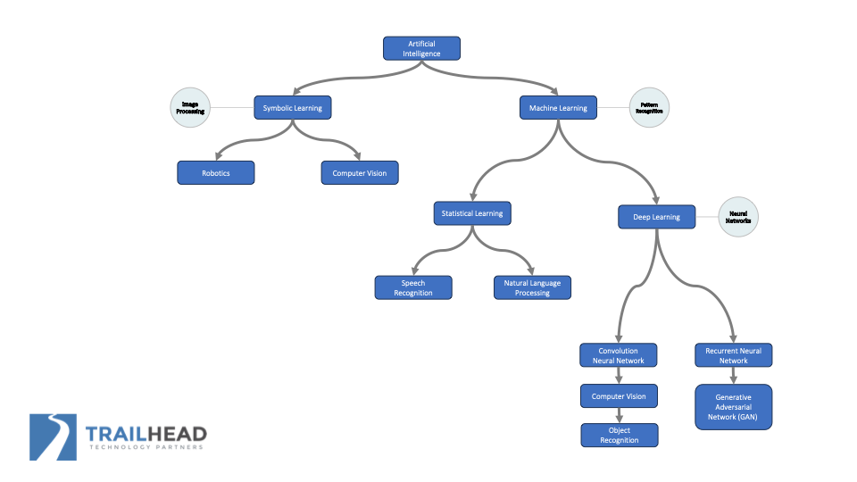
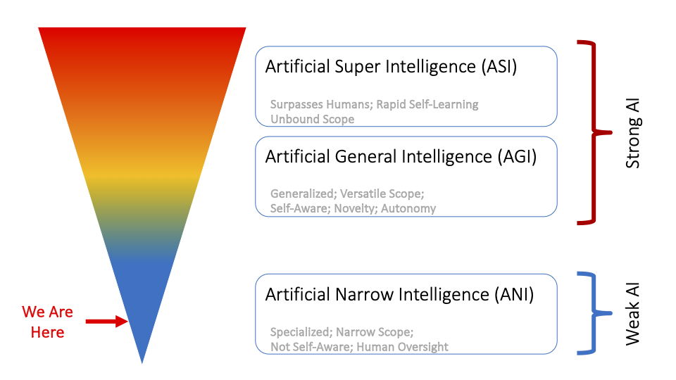

# Cincy Deliver 2024

*July 26th, 2024*  
Cincinnati, OH

## Is Everyone AI-ing Without Me? A .NET Developers Guide to Development with AI

with [J. Tower](https://www.linkedin.com/in/jtower/)

AI right now is like the Internet in the early 1990s.

### AI with .NET
+ Azure AI services (fka Cognitive Services) provide AIaaS, MLaaS
+ In code, ML.NET and Custom Copilots
+ Azure and OpenAI APIs do not use your data for training, and you can opt out of data retention

+ An LLM must be run online, whereas a "reasonably-sized" LM can be run locally.

### ML.NET
+ runs without a live connection
+ use to train a custom model
+ [J on ML.NET](https://www.youtube.com/watch?v=dWCqryuCJS8) on the Blue Blazes podcast

### Visual Studio ML Builder
+ generates model as a .zip
+ `MlContext.Model.Load(zip)`

+ Semantic Kernel is the corelib of MS copilots
+ Cognitive Toolkit is for creating custom Neural Networks (for more power and control)

## Better Remote Teamwork through Emotional Intelligence

with [Ben Friedberg](https://www.linkedin.com/in/ben-friedberg/)

## Creating Your First AI-Based Product

with [Rich Theil](https://www.linkedin.com/in/richtheil/)

## Returning to Tech... Twice

with [Ashley Stove](https://www.linkedin.com/in/aastove/)

