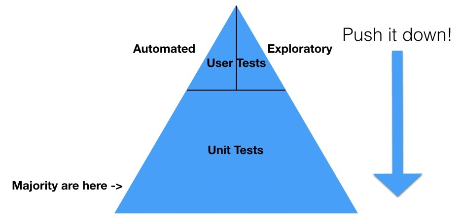

# CodeMash
*January 10-11, 2019*  
*Sandusky, OH*

## Leadership Guide for the Reluctant Leader
with [David Neal](https://twitter.com/reverentgeek)

"Punching Bears" = doing really difficult things. Have you punched any bears today?

Many developers who get promoted to management enter a cycle of being promoted, then leaving their job to get back into coding. Only to be promoted to management again.

**Leadership** is not just for people in management, "it's for ALL Y'ALL". Being a leader means speaking up for the betterment of the group, setting an example with your own behavior, having tough conversations.

David attended an **emerging leaders** group that met to actively develop these skills.

Negotiation is a leadership skill.

Leaders strike the right balance of compassion, care, and empathy.

> Humility is not thinking less of yourself, but thinking of yourself less.  
-- C.S. Lewis

DISC analysis can help you to understand the different personality types at play on your team. Particularly, which ways they can best absorb information 

### Don't Multitask
A lion tamer's whip does nothing to the lion--it's just for show. What really tames the beast is the chair. When the tamer presents the lion with its four legs, the lion becomes paralyzed trying to decide which one to go after.

### Speak professionally
There are three sure things in life: death, taxes, and PowerPoint.

When you punch the bear of sharing what you know with a group, everyone wins. Your audience absorbs what you have learned, and you harden the lessons in your own mind through refining them for presentation.

### Change your job
Life is too short to work somewhere that stinks.

**But before you jump ship**  
1. Have you done everything you could do about it?  
2. If you left, would you have any regrets?

Life is too short to let things stay the way they are.

### Appreciate
We commonly pay great tributes to our co-workers when they quit or retire. Why wait? Publicly acknowledge them and their work *while they're still there*!

<blockquote class="twitter-tweet" data-lang="en">
You never know when some words or act of kindness on your part could launch someone on their journey. <a href="https://twitter.com/reverentgeek?ref_src=twsrc%5Etfw">@reverentgeek</a> <a href="https://twitter.com/hashtag/codemash?src=hash&amp;ref_src=twsrc%5Etfw">#codemash</a>
&mdash; Fazzaro (@jonfazzaro) <a href="https://twitter.com/jonfazzaro/status/1083387253920071680?ref_src=twsrc%5Etfw">January 10, 2019</a></blockquote>

**Further reading**  
[The Ideal Team Player (Lencioni)](https://www.amazon.com/Ideal-Team-Player-Recognize-Cultivate-ebook/dp/B01B6AEJJ0)  
[Strengths Finder (Rath)](http://www.tomrath.org/book/strengthsfinder/)  

## 12 skills every rookie programmer should have, but often don't
with [Andy Lester](https://twitter.com/petdance)

Experienced software developers are often surprised and frustrated at what newer developers don't know. 

1. **Tools**. Be comfortable with your editor/IDE, but also with working outside it (e.g. at the command line). Know your source control tooling.
	- **Let the language help**. Learn your language/framework well enough that you don't reinvent the wheel.
	- **Static analysis**. Learn to read metrics about your code for things you can't see.
	- **Better editors**. Don't use notepad! Use something powerful like emacs or vim ("God's own editor").
1. **Scripts**. Thinking and creativity are for humans. Leave the repetitious drudge work to the computers. 
1. **HTML/CSS**. Understand advantages of semantic over physical markup. It is a microcosm for understanding the principle of **separation of concerns**.
1. **SQL**. Often a programmer's first encounter with non-procedural code.
1. **Regular Expressions**. Use them for validating data, searching code. [Don't use them for parsing](http://htmlparsing.com/). PROTIP: comment each part of your regex using `#` and line breaks.
1. **Problem-solving**. Debugging. Narrowing big issues down into small issues. Defensive programming. 
<blockquote class="twitter-tweet" data-lang="en">
Academic: &quot;What is your company really looking for? Java? SQL?&quot; Me: &quot;Proven problem solving skills.&quot;
&mdash; Tom Callaway (@spotrh) <a href="https://twitter.com/spotrh/status/1082693252489375747?ref_src=twsrc%5Etfw">January 8, 2019</a></blockquote>

1. **Testing**. Learn how to creatively cause problems. Understand how to automate testing using unit tests and continuous integration.
1. **DRY (Don't Repeat Yourself)**. The opposite of WET (Write Everything Twice OR We Enjoy Typing).
1. **Efficiency**. Not necessarily processor/code efficiency--often this is way less important than the efficiency clean, readable code affords to a human developer. Developer time is worth orders of magnitude more than processor time.
1. **Thinking Business**.
<blockquote class="twitter-tweet" data-lang="en">
How do you get your boss to let you {x}? Show how {x} will make money. <a href="https://twitter.com/petdance?ref_src=twsrc%5Etfw">@petdance</a> <a href="https://twitter.com/hashtag/codemash?src=hash&amp;ref_src=twsrc%5Etfw">#codemash</a>
&mdash; Fazzaro (@jonfazzaro) <a href="https://twitter.com/jonfazzaro/status/1083508853717766144?ref_src=twsrc%5Etfw">January 10, 2019</a></blockquote>

1. **Working with existing code**. Understand how to read, evaluate, and critique it **without ever bad-mouthing it**.
1. **Telecommuting**. You will only do more of this in your career, and written communication skills are even more crucial to master. To get good at this and other remote skills, begin contributing to Open Source projects.

**Further Reading**  
[Code Complete (McConnell)](https://www.amazon.com/Code-Complete-Practical-Handbook-Construction/dp/0735619670)  
[Pragmatic Programmer (Hunt, Thomas)](https://www.amazon.com/Pragmatic-Programmer-Journeyman-Master/dp/020161622X/)

## Continuous Delivery requires radical changes for testers
with [Jeff "Cheezy" Morgan](https://twitter.com/chzy)

**Continuous Delivery** in this context is the practice of deploying software to production with every source control commit.

The goal of this practice is to run experiments in Production with customers to quickly build better software products.

Users lie about what they want. For better guidance/intel, watch what they **do**.

There is no testing phase.

Cheezy refers to smaller (non-end-to-end) integration tests as unit tests, to keep the pyramid simpler.

**Fewer User Tests, more Unit Tests**. Whenever possible, test something using a Unit Test. The team should do what it can to convert existing User Tests into Unit Tests.

### Case study

A group of 22 teams (5 developers and 1 tester per team, working on the same codebase) produced a suite of 40k User Tests and 2k Unit Tests. The suite never ran to completion--it would churn on for nearly 2 days before someone had to stop (or restart) it.

Working together in pairs and mobs, the teams converted User Tests to Unit Tests until they had closer to 150k Unit Tests. Now the suite runs to completion all the time.

The remaining Manual tests are all exploratory in nature, things that automation could not accomplish. Developers participate in manual testing efforts.

### Testing non-functional requirements

Things like visual appearance, accessibility, compliance (like OSS license checking), security, performance can all be automated and integrated into the pipeline.

### Fitness Functions 
> An architectural fitness function provides an objective integrity assessment of some architectural characteristic(s).  

-- Neal Ford, [Building Evolutionary Architectures](https://www.oreilly.com/library/view/building-evolutionary-architectures/9781491986356/ch02.html)

### Quality is a shared responsibility
Developers do not depend on QA to validate their software for them--they depend on assistance and coaching from QA so that they (the dev team) can better validate their software for themselves.

"This is done!" < "I think this is done. What did I not think of?"

Agree on a common checklist (like a Definition of Done) for each change. Automate as much of it as possible.

**DevOps** is about giving development teams the tools to own their production pipeline and production environment.

Stop using branches in source control. They encourage more WIP (waste), and discourage merciless refactoring.

**High trust development teams** use pair/mob programming and develop directly on master. **Low trust development teams** (such as those working on an open-source project) work asynchronously and use branches and pull requests to integrate their work.

Branch-based development < Feature toggles < Feature toggles controlled by the Product Owner

**Separate the idea of release from the idea of deployment**. The dev team manages deployment, but gives the Product/business Owner the trigger to release features via toggling.

After a toggle has been on for a certain amount of time in production, the dev team gets notified, prompting a conversation about removing the flag code altogether.

"Feature flags are not `if` statements". Then... what? (@chzy promises he's working on a talk that does a deep dive into this.)

### Zero-Defect Policy
Don't track bugs. When a bug is found, stop writing new code and fix it! Like an [andon cord](https://www.agiletestingframework.com/incorporating-andon-cord-in-devops/) that stops the line in a factory.

Post a sign in your team's area showing how many days since the last bug was found.

Q: "Doesn't the Product Owner get to prioritize which bugs get fixed?"  
A: "Yes--but they already did that when they prioritized the story that the bug has broken!"

<blockquote class="twitter-tweet" data-lang="en">
We don’t look at code coverage—that’s a bullshit metric. <a href="https://twitter.com/chzy?ref_src=twsrc%5Etfw">@chzy</a> <a href="https://twitter.com/hashtag/codemash?src=hash&amp;ref_src=twsrc%5Etfw">#codemash</a>
&mdash; Fazzaro (@jonfazzaro) <a href="https://twitter.com/jonfazzaro/status/1083510278808109056?ref_src=twsrc%5Etfw">January 10, 2019</a></blockquote>

**User Test Fragility** usually manifests as timing issues or state (data) changes. To mitigate the latter, write your tests with **less specific assertions**. For example, rather than asserting that an account balance is a specific amount, assert that the amount has changed in the correct direction (increased/decreased).

An effective pipeline should run in under 30 minutes.

**Blue/green deployment**. A continuous pipeline to one (non-production) environment. Release is handled by swapping the environment with production, and aiming the pipeline at the environment that was previously production.

**Dark deployment**. A continuous pipeline to a non-production environment. Release is handled by promoting the deployment to production.

**Treat your environments like cattle, not pets**. To run User Tests in a pipeline, first have the pipeline create the environment from scratch (as opposed to using a persistent test environment). The pipeline will also tear it down after the test run.

**Testers must become more code-y, coders more test-y**, until the two become *indistinguishable* to anyone not on the team.

**THERE IS NO AUTOMATION TEAM**.   
This is the worst idea.

**Further Reading**  
[Explore It (Henderson)](https://www.amazon.com/Explore-Increase-Confidence-Exploratory-Testing-ebook-dp-B00I8W50T8/dp/B00I8W50T8/)  
[Building Evolutionary Architectures (Kua, Parsons, Ford)](https://www.amazon.com/Building-Evolutionary-Architectures-Support-Constant/dp/1491986360)

## Getting Unstuck
with [Steven Hicks](https://twitter.com/pepopowitz)

#### Step Zero
**Embrace Stuckness**. For knowledge workers, getting stuck is the job.

<blockquote class="twitter-tweet" data-lang="en">
Getting stuck is the job. <a href="https://twitter.com/pepopowitz?ref_src=twsrc%5Etfw">@pepopowitz</a> <a href="https://twitter.com/hashtag/codemash?src=hash&amp;ref_src=twsrc%5Etfw">#codemash</a> <a href="https://twitter.com/hashtag/stuckness?src=hash&amp;ref_src=twsrc%5Etfw">#stuckness</a>
&mdash; Fazzaro (@jonfazzaro) <a href="https://twitter.com/jonfazzaro/status/1083730427653824512?ref_src=twsrc%5Etfw">January 11, 2019</a></blockquote>

	
1. **Explain the problem to another human**. Or perhaps a [rubber duck](https://en.wikipedia.org/wiki/Rubber_duck_debugging). 
2. **Isolate the problem**. Sometimes you're just juggling too many ideas at once.
3. **Escape the problem**. Knowledge work presents us with analogical problems--ones that require that we make unusual connections of ideas to solve. In order to engage the part of your brain that does this, there must first be a period of incubation. 

	### The 4 Stages of Creativity 
	([Jessica Stillman, 2014](https://www.futurelearn.com/courses/creative-problem-solving/0/steps/43756))
	1. Preparation
	2. Incubation
	3. Illumination (Insight, in [James Taylor's version](https://www.jamestaylor.me/creative-process-five-stages/))
	4. Verification (Taylor split these into Evaluation and Elaboration)

	TL;DR: Take a walk. Put the problem down when you're stuck, and do a different type of activity to allow for it to incubate in your subconscious. Conscious thought is linear, but the subconscious mind specializes in abstract and parallel processing.
	
	This also works because when you return to the problem, you must re-learn it, which has a similar effect to explaining it to someone else. (In the future, you're someone else).

4. **Harden yourself**. Set up your work habits and space to accommodate being stuck, so that you don't get lost on top of everything else.   

	Take regular breaks (even if you're not stuck).  
	Meditate to condition and observe your mind.  
	Browse other people's work to see how they solved their problems.    
	Keep a journal.  
	Exercise.  
	Talk about your struggles with others.  
	Listen to them about theirs.  
	

	
	
