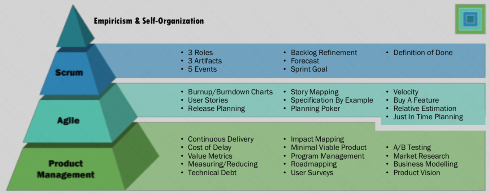
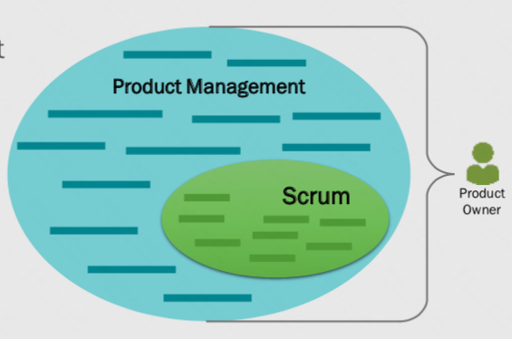
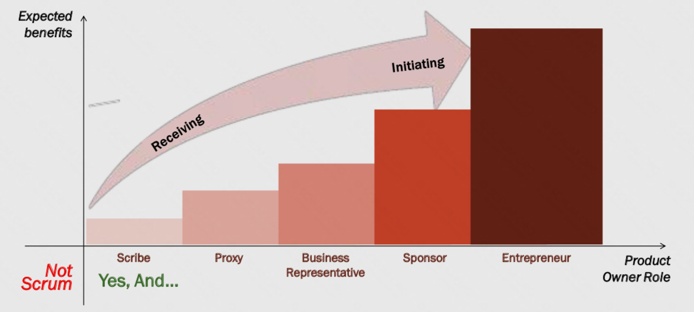
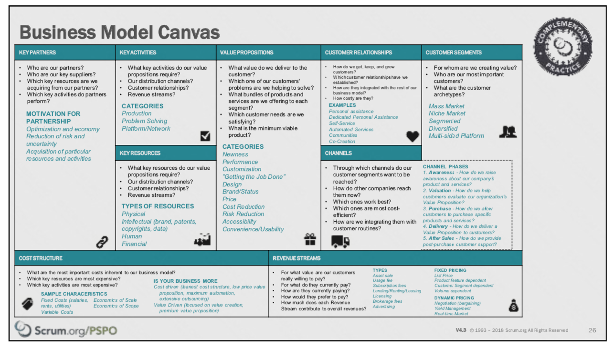
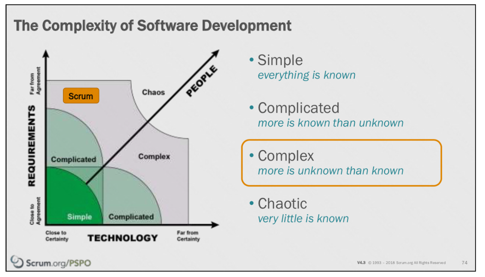
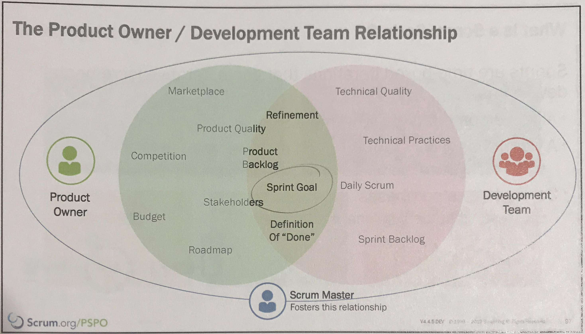
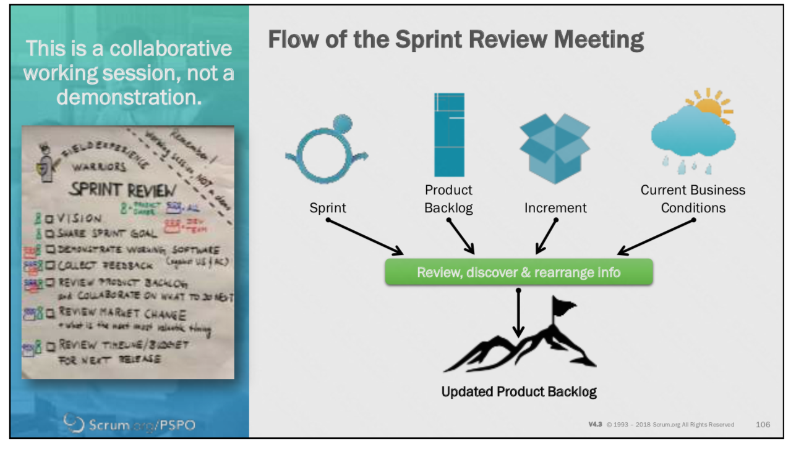
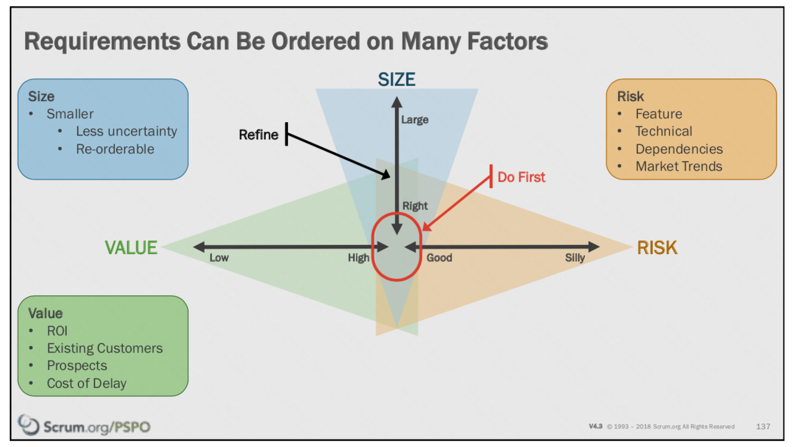
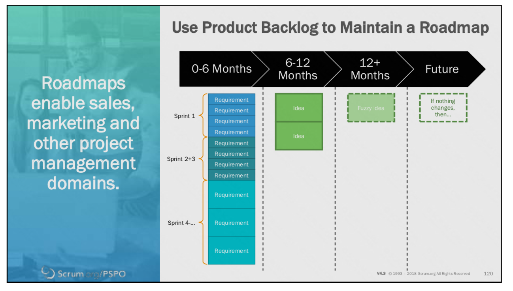

# Professional Scrum Product Owner 
Course led by [Dr. Tess Thompson](https://www.scrum.org/teresa-thompson)  
*May 8-9, 2019*

## Agile Product Management

**Product Management** is a larger discipline in which Scrum can be applied. 

A **Product Owner** is simply a Product Manager who practices Scrum.

A **Project Mindset** defines success up front, from the inside out (based on project metrics (time/scope/budget/etc.)).

A **Product Mindset** continuously drives success from the outside in (based on business metrics (user adoption, retention, revenue, cost savings per feature, etc.)

Define your "Product" as broadly as you can to embrace global (over local) optimization.

### The Bigger Picture

Company Vision and Business Strategy are the domain of **Organization Leaders**.

The members of the **Development Team** cover making a sprint plan and daily planning.

Product Vision, Product Strategy, and Release Planning are the responsibility of the **Product Owner**.

### A Product Owner is a...

The *Scribe* and *Proxy* duties can be effectively delegated to a member of the dev team, like a Business Analyst. A Product Owner should be thinking well beyond this level.

### Modeling Business Strategy
**Business Model Canvas**  
**Lean Canvas**  
**Value Proposition Canvas**  
Generated in a group session  
Exercises to clarify everyone's mental model of a business  
The canvas documents they produce are not as important as the process of creating them--they are **living documents**.

When creating, work right to left.

Yes, **rank your customers**. They cannot all be #1!

### Vision

**Template**  
For [target audience]  
Who [need/want something]  
[product name] is a [market category]  
That [one key benefit]  
Unlike [competition or current situation]  
Our Product [competitive advantage].  

### Quitting

> More organizations die of indigestion than starvation.

--David Packard

Discontinuing products is not what kills you. 

A Product Owner should be tech-minded, but not necessarily able to write code themselves.

## Value-driven Development

What is the only way for a Scrum Team to deliver value? **Ship something**.

> Once an indicator or other surrogate measure of performance is made a target or incentive for the purpose of driving behavior, it loses the information content that qualifies it to play such a role.

-- Robert D. Austin, *Measuring and Managing Performance in Organizations*

### Evidence-Based Management

There are so many more interesting things to measure besides **velocity**.

#### Current Value	
Measures value delivered to customer or user today.

- Revenue per employee  
- Product Cost ratio  
- Employee satisfaction  
- Customer satisfaction  
- Usage index

#### Unrealized Value	
Measures value that could be realized by meeting all potential needs of the customer or user.

- Market share  
- Customer or User Satisfaction Gap  

#### Ability to Innovate	
Measures the ability to deliver a new capability that might better serve a customer or user need.

- **Innovation Rate** (percent of budget spent on **Building New Functionality** vs. **Maintaining Existing Functionality** vs. **Expanding Capacity**)  
- Time spent context switching  
- Usage index  
- Installed version (or browser usage, for web apps) index  
- Technical Debt  
- Defect Trends  
- Product incident trends

#### Time to Market 	
Measures the ability to quickly deliver new capability, service, or product

- Build + Integration frequency  
- Release frequency  
- Release stabilization period  
- Mean Time to Repair  
- Cycle Time  
- Lead Time  
- On-Product index  
- Time to learn  

More [here](https://scrum.org/ebm).

## Scrum Theory + Empiricism

A Product Owner must manage up to their Stakeholders. A **Project Manager** can help with this work.

**Complex** is the sweet spot for Scrum.  

**Simple**? SDLC (Waterfall).  
**Chaotic**? Kanban.

**Defined** (Classical music, Pizza Hut, assembly line, construction, accounting)  
vs.   
**Empirical** (Jazz, Subway, sales, marketing, theater, creative writing)

Empirical processes require **Trust** and **Courage**.

#### Scrum Values
Courage  
Focus  
Commitment  
Respect  
Openness

## The Scrum Framework

Scrum is a *framework* (not a *process*, not a *methodology*).

### The Product Owner should lead the Sprint Review.

Why does the Product Owner care about the team's Definition of Done?   
**Because it ensures that the increment the team produces is shippable.**

**Retrospective action items** go directly into the next *Sprint* Backlog (not the Product Backlog or another repository).

## Product Backlog Management

A **Product Backlog Item (PBI)** is not a traditional requirements document. It is  not an exhaustive legal document, but rather a *promise for a conversation*, with the *conversation being more important* than the card itself.

Card  
Conversation  
Confirmation

The more trust you have, the less detail you need. 

The Product Backlog should read like a table of contents for the future of your product.

**Ready**: the point on the team's *Definition of Done* where they are comfortable adding the item to a sprint.

### Beyond the Sprint: the roadmap

